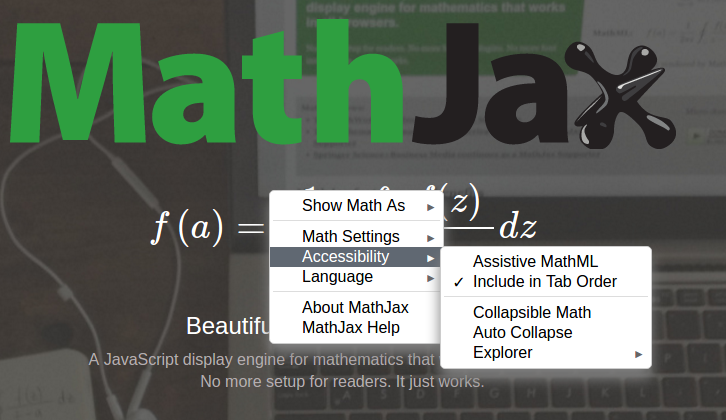
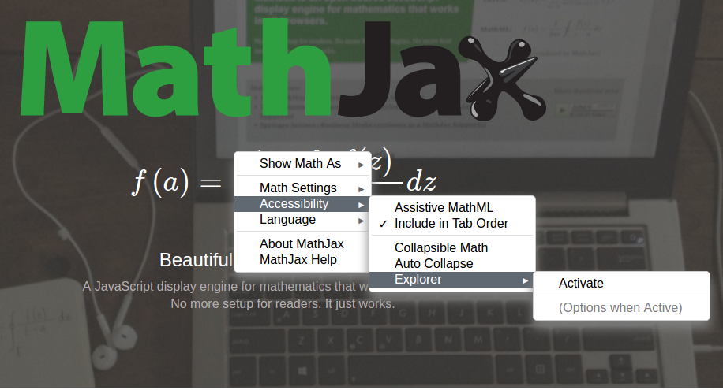
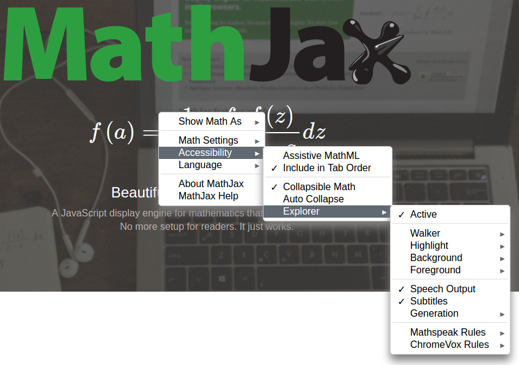

# MathJax Accessibility Extensions Documentation

* [Introduction](#introduction)
* [Quick Start](#quick-start)
* [Reader Guide](#reader-guide)
  * [Keyboard Exploration](#keyboard-exploration)
  * [Bookmarklet](#bookmarklet)
* [Configuration and use](#configuration-and-use)
  * [accessibility-menu.js](#accessibility-menu.js)
  * [explorer.js](#explorer.js)
  * [auto-collapse.js](#auto-collapse.js)
  * [collapsible.js](#collapsible.js)
  * [semantic-enrich.js](#semantic-enrich.js)
  * [mathjax-sre.js and its components](#mathjax-sre.js-and-its-components)
  * [Compatibility](#compatibility)
* [Support](#support)
  * [Browser support](#browser-support)
  * [Mobile support](#mobile-support)
  * [MathJax output support](#mathjax-output-support)
  * [Screenreader support](#screenreader-support)
    * [Using the explorer](#using-the-explorer)
    * [Browse and Focus mode](#browse-and-focus-mode)
    * [Missing and excessive voicing](#missing-and-excessive-voicing)
    * [Summary of test results](#summary-of-test-results)
* [Demos](#demos)
* [Videos](#videos)

## Introduction

The MathJax Accessibility Extensions provide several features for enabling accessible rendering of equations. These come in the form of several [MathJax extensions](http://docs.mathjax.org/en/latest/advanced/extension-writing.html):

* `accessibility-menu.js`, a lightweight (<1kb zipped) extension to extend the MathJax Menu with opt-in functionality for assistive features.
* `explorer.js`, an extension that provides speech-text generation as well as expression exploration and highlighting functionality.
* `auto-collapse.js`, an extension that provides a responsive rendering mode that collapses subexpressions to fit equations on smaller screens.
* `collapsible.js`, an extension that adds the ability to collapse expressions based on estimates of the complexity of the expressions and their subexpressions [used by `auto-collapse.js` and `explorer.js`].
* `semantic-enrich.js`, an extension that coordinates between MathJax and `mathjax-sre.js` to enrich MathJax's internal representations with semantic information about the expressions [used by all the extensions above].
* `mathjax-sre.js` (and its components), a custom build of [speech-rule-engine](https://github.com/zorkow/speech-rule-engine/), providing semantic enrichment and speech-text generation.

### Quick start

The easiest way to get started is by adding the Accessibility Menu Extension to your MathJax configuration. This adds very little load to your site while providing your visitors with an accessible opt-in for all features.

Version 2.7.0 included the Accessibility Menu Extension in its combined configuration files, so users of most websites that load MathJax will have access to the new menu automatically.

For MathJax v2.6, you need to load the extensions from a v2.7 distribution.

**Note**. The extensions require MathJax v2.6 or higher. 

To load the Accessibility Menu Extension, you set the custom configuration path and add the extensions to your configuration's `extensions` array, e.g., add

```html
<script type="text/x-mathjax-config">
MathJax.Ajax.config.path["a11y"] = "https://cdnjs.cloudflare.com/ajax/libs/mathjax/2.7.1/extensions/a11y";
MathJax.Hub.Config({
  // ...your configuration options...
  extensions: ["[a11y]/accessibility-menu.js"]
});
</script>
```

**before** you load `MathJax.js` itself.

By default, the Accessibility Menu will not load any of the other extensions, but merely extends the menu with options for users to opt-in to the other extensions.

Of course, you can activate the sub-extensions by loading them directly in the extensions array or by using the `menuSettings` configuration option, e.g.,

```html
<script type="text/x-mathjax-config">
MathJax.Ajax.config.path["a11y"] = "https://cdnjs.cloudflare.com/ajax/libs/mathjax/2.7.1/extensions/a11y";
MathJax.Hub.Config({
  // ...your other configuration options...
  extensions: ["[a11y]/accessibility-menu.js"]
  menuSettings: {
    collapsible: true,
    autocollapse: true,
    explorer: true
  }
});
</script>
```

### Local installation

The MathJax accessibility extensions require a more complex build process than other MathJax extensions. You can download pre-compiled packages from the [GitHub release page](https://github.com/mathjax/MathJax-a11y/releases) or  build your own copy using Grunt, see the [repository's README](https://github.com/mathjax/MathJax-a11y/)).

## Reader Guide

On a site that loads any of the MathJax Accessibility Extensions, you will find three additional items in the "Accessibility" submenu of the MathJax Menu. These items control the respective extensions:

* "Collapsible Math" (toggle)
* "Auto-Collapse" (toggle)
* "Explorer" (submenu)



If the Explorer Extension is not active, its submenu will only list one toggle "Activate" and a hint that more options will appear in this submenu when the Explorer Extension is active.



If the Explorer Extension is active, you will see a submenu structure exposing all its options:

* Active (toggle)
* (separator)
* Walker (submenu of radio buttons)
  * No Walker
  * Syntax Walker (default)
  * Semantic Walker
* Highlight (submenu of radio buttons)
  * None (default)
  * hover
  * flame
* Background (submenu of radio buttons)
  * Blue (default)
  * Red
  * Green
  * Yellow
  * Cyan
  * Magenta
  * White
  * Black
* Foreground (submenu of radio buttons)
  * Black (default)
  * White
  * Magenta
  * Cyan
  * Yellow
  * Green
  * Red
  * Blue
* (separator)
* Speech Output (toggle)
* Generation (submenu of radio buttons)
  * Eager
  * Mixed
  * Lazy (default)
* (separator)
* MathSpeak Rules
  * Verbose (default)
  * Brief
  * Superbrief
* ChromeVox Rules
  * Verbose
  * Short
  * Alternative



Let us quickly describe their function:

* "Walker": controls the style of exploration.
* "Highlight": adds a highlight to indicate the complexity measure for subexpressions (especially useful in combination with collapsed expressions)
* "Background/Foreground": set the color for Highlight which is also used when using the walker to explore an expression
* "Speech Output" activates the generation of speech-text in both top-level ARIA labels as well as synchronized speech-text when exploring
* "Generation" determines if the speech output on the outer element provides a short summary, a longer summary or a speech string for the entire expression
* "MathSpeak/ChromeVox Rules": allows you to choose between the different rule sets for speech-text generation.

### Keyboard Exploration

The Explorer's Walker option enables keyboard navigation for exploring sub-expressions simultaneously visually and aurally. The application uses the following keys bindings:

* <kbd>SHIFT+SPACE</kbd>: start application (requires focus)
  * **NOTE:** Depending on the implementation quality of the particular browser/screenreader/OS combination (especially Chrome and IE), users might have to disable screenreader reading modes (e.g., "browse mode" in NVDA, "virtual cursor" in JAWS) before being able to launch the application.
* <kbd>ESC</kbd>: stop application.
  * **NOTE:** When restarted, the application will continue where the user left off.
* <kbd>UP</kbd>/<kbd>DOWN</kbd>: move up or down the sub-expression tree.
  * When moving down, navigation will start at the left-most sub-expression of the level.
  * The application plays an aural indicator (earcon) if the user is at the bottom/top level of the tree.
* <kbd>LEFT</kbd>/<kbd>RIGHT</kbd>: navigate the current level in the sub-expression tree horizontally.
* <kbd>ENTER</kbd>:  switch collapsed state of the current sub-expression and regenerate speech-text to match (e.g., provide summary upon collapsing).
* <kbd>SPACE</kbd>: get positional information, i.e., the current level in the sub-expression tree as well as collapsibility/expandability of the current subexpression.

For information on the keyboard navigation of the Explorer's walker, please see the [configuration section]() and the [support section]() below.

### Bookmarklet

If you encounter a page without the Accessibility extension, you can sideload the extensions via a bookmarklet, e.g., the following would load the Accessibility Menu:

```javascript
if(window.MathJax){
  MathJax.Ajax.config.path["a11y"] = "https://cdnjs.cloudflare.com/ajax/libs/mathjax/2.7.1/extensions/a11y";
  MathJax.Ajax.Require("[a11y]/accessibility-menu.js");
}
```

Or simply <a href='javascript:if(window.MathJax){ MathJax.Ajax.config.path["a11y"] = "https://cdnjs.cloudflare.com/ajax/libs/mathjax/2.7.1/extensions/a11y"; MathJax.Ajax.Require("[a11y]/accessibility-menu.js"); }'> drag this link to your bookmarks</a>.

## Configuration and Use

### accessibility-menu.js

This extension has no configuration block of its own but is controlled via the MathJax Menu settings. Below are the options in their default setting.

```javascript
menuSettings: {
  collapsible: false,  // true, false
  autocollapse: false, // true, false
  explorer: false      // true, false
}
```

* `collapsible`: if set to `true`, this loads and enables the extension `collapsible.js` (cf. below)
* `autocollapse`: if set to `true`, this loads and enables the extension `auto-collapse.js` (cf. below).
* `explorer`: if set to `true`, this loads and enables the extension `explorer.js` (cf. below).

Note that all of these extensions will trigger a re-rendering of the output as the underlying MathML will be modified to reflect the semantic analysis. This can lead to small changes in visual rendering such as properly matching fence sizes.

### explorer.js

The Explorer extension provides exploration tools for sub-expressions. It is the largest piece of the accessibility extensions.

The extension provides highlighting of sub-expressions and top-level speech-text generation, as well as an application providing accessible keyboard navigation for sub-expressions with on-the-fly, synchronized highlighting and speech-text generation.

The highlighting can provide highlights on hover or permanent highlights using opacity to represent complexity.

The top-level speech-text generation adds an aria-label to the outermost element of MathJax's output.  The menu allows the user to control various length options (so as to provide short summaries).

The application for keyboard navigation allows users to explore sub-expressions simultaneously visually and aurally. The application uses the following keys bindings:

* <kbd>SHIFT+SPACE</kbd>: start application (requires focus)
  * **NOTE:** Depending on the implementation quality of the particular browser/screenreader/OS combination (especially Chrome and IE), users might have to disable screenreader reading modes (e.g., "browse mode" in NVDA, "virtual cursor" in JAWS) before being able to launch the application.
* <kbd>ESC</kbd>: stop application.
  * **NOTE:** When restarted, the application will continue where the user left off.
* <kbd>UP</kbd>/<kbd>DOWN</kbd>: move up or down the sub-expression tree.
  * When moving down, navigation will start at the left-most sub-expression of the level.
  * The application plays an aural indicator (earcon) if the user is at the bottom/top level of the tree.
* <kbd>LEFT</kbd>/<kbd>RIGHT</kbd>: navigate the current level in the sub-expression tree horizontally.
* <kbd>ENTER</kbd>:  switch collapsed state of the current sub-expression and regenerate speech-text to match (e.g., provide summary upon collapsing).
* <kbd>SPACE</kbd>: get positional information, i.e., the current level in the sub-expression tree as well as collapsibility/expandability of the current subexpression.

Below are the configuration options for the extension set to their defaults (with in-depth explanations in their comments).

```javascript
explorer: {
  walker: 'syntactic',         // none, syntactic, semantic
  highlight: 'none',           // none, hover, flame
  background: 'blue',          // blue, red, green, yellow, cyan, magenta, white, black
  foreground: 'black',         // black, white, magenta, cyan, yellow, green, red, blue
  speech: true,                // true, false
  generation: 'lazy',          // eager, mixed, lazy
  subtitle: true,              // true, false
  ruleset: 'mathspeak-default' // mathspeak-default, mathspeak-brief, mathspeak-sbrief, chromevox-default, chromevox-short, chromevox-alternative
}
```

* `walker`: specifies the rules for the exploration tool. The `semantic` mode tries to group sub-expressions into meaningful parts (e.g., plus and the following summand together).
* `highlight`: specifies the highlighting of sub-expression complexity. If set to `hover`, hovering the pointer will highlight the sub-expression. If set to `flame`, highlighting will use opacity of the background color to indicate the complexity of a sub-expression.
* `background`:  determines the background color used for highlighting.
* `foreground`:  determines the foreground color used for highlighting.
* `speech`: controls whether speech text is generated.
* `generation`: controls the level of detail in the top-level speech text (as opposed to the walker).
* `subtitle`: controls whether subtitles containing speech text are shown below the expression.
* `ruleset`: determines the ruleset used for speech-text generation.


### auto-collapse.js

This extension will automatically collapse sub-expressions to allow the resulting equation to fit in the viewport width and will react to changes in viewport width. It will automatically load `collapsible.js` (see below).

The extension only offers a configuration option to disable it.

```javascript
"auto-collapse": {
  disabled: false;
}
```


### collapsible.js

This extension generates a complexity metric (using semantic enrichment, cf. `semantic-enrich.js`) and inserts elements that allow the expressions to be collapsed by the user by clicking on the expression based on that metric.

The extension only offers a configuration option to disable it.

```javascript
collapsible: {
  disabled: false;
}
```

### semantic-enrich.js

This extension coordinates the creation and embedding of semantic information generated by the enrichment process (cf. `mathjax-sre.js` below) within the MathJax output for use by the other extensions.

The extension only offers a configuration option to disable it.

```javascript
"semantic-enrich": {
  disabled: false;
}
```

### mathjax-sre.js and its components

The remaining files part of the accessibility extensions contain a custom build of the [speech-rule-engine](https://github.com/zorkow/speech-rule-engine/), which provides semantic analysis of MathML as well as speech-text generation.


### Compatibility

When a user activates the Accessibility Extension's speech generation, the extension will disable the `AssistiveMML` extension (automatically loaded with MathJax v2.6+); otherwise, some screenreaders would read the math twice.

Accordingly, if a page author configures the MathJax Accessibility extensions to **always** produce speech text, then they should disable the AssistiveMML extension.


## Support

Our test results for the accessibility extensions vary significantly, depending on the combinations of browser, OS, and screenreaders. While we cannot claim universal support for any combination the extensions should provide good results when only 1 or 2 out of 3 requirements are fixed.

### Browser support

Support is focused on the currently maintained browsers, i.e.,

* IE 10+ and Edge
* Chrome
* Safari
* Firefox

Except for IE, older versions should work as well. Due to severe browser bugs, we cannot support IE 9 and below.

### Mobile support

Basic voicing (via aria-labels) should work using Apple VoiceOver and Android Talkback. The explorer tool does not yet support sub-expression exploration on mobile browsers / touchscreen interfaces.

### MathJax output support

While the extensions generally work with any MathJax setup, the explorer only works with MathJax's CommonHTML, SVG, and HTML-CSS output.

**Note**. The extensions require MathJax v2.6 or higher.

### Screenreader support

We have tested the following screenreaders with the supported browsers on various OS versions.

* NVDA 2016.2 (Win XP, 7, 8, 10)
* JAWS 17 (Win 7, 8, 10)
* WindowEyes 9.4 (Win 7, 8, 10)
* ChromeVox 50 (any)
* VoiceOver (OS 10.10, iOS 9.1)
* TalkBack (Android Marshmallow)
* [ORCA (3.18, Ubuntu 16.04)]
* [Dolphin Screenreader (Windows 10)]

Not all combinations of screenreader and browser are usable but for each one (except ORCA and Dolphin) should find some combination that works. In particular, the basic speech-text via ARIA lables should be widely supported.

Other screenreaders and/or assistive technologies were tested but failed due to lack of support for ARIA labels and/or live regions.

#### Using the explorer

The application for keyboard navigation allows users to explore sub-expressions simultaneously visually and aurally. The application uses the following keys bindings:

* <kbd>SHIFT+SPACE</kbd>: start application (requires focus)
  * **NOTE:** Depending on the implementation quality of the particular browser/screenreader/OS combination (especially Chrome and IE), users might have to disable screenreader reading modes (e.g., "browse mode" in NVDA, "virtual cursor" in JAWS) before being able to launch the application.
* <kbd>ESC</kbd>: stop application.
  * **NOTE:** When restarted, the application will continue where the user left off.
* <kbd>UP</kbd>/<kbd>DOWN</kbd>: move up or down the sub-expression tree.
  * When moving down, navigation will start at the left-most sub-expression of the level.
  * The application plays an aural indicator (earcon) if the user is at the bottom/top level of the tree.
* <kbd>LEFT</kbd>/<kbd>RIGHT</kbd>: navigate the current level in the sub-expression tree horizontally.
* <kbd>ENTER</kbd>:  switch collapsed state of the current sub-expression and regenerate speech-text to match (e.g., provide summary upon collapsing).
* <kbd>SPACE</kbd>: get positional information, i.e., the current level in the sub-expression tree as well as collapsibility/expandability of the current subexpression.

#### Browse and Focus mode

Most screenreaders have at least two modes for interaction: Browse (or virtual) and Focus (or forms) mode. For more information see [Leonie Watson's introduction](http://tink.uk/understanding-screen-reader-interaction-modes/). Some combinations of browsers and screenreaders do not automatically switch to Focus mode on an element with ARIA Role `application`.

In this situation, a user will have to manually switch from Browse mode to Focus mode to enable interaction with our explorer application. As an additional complication, MathJax's different outputs can change the behavior; e.g., SVG output might trigger some screenreader behavior specific to SVGs or images.

* NVDA (Browse/Focus Mode) is switched via <kbd>NVDA+SPACE</kbd> (default: <kbd>INS</kbd> or <kbd>CapsLock</kbd>). If MathJax's SVG output is used, NVDA might switch to Focus Mode automatically (in particular on older Windows Versions).
* JAWS ("Virtual PC Cursor") is switched via <kbd>JAWS+Z</kbd> (default: <kbd>INS</kbd>)
* Window Eyes (Browse/Focus Mode) is switched via <kbd>CTRL+SHIFT+A</kbd>
* VoiceOver has no modes but <kbd>SHIFT+CTRL+CMD+ARROW</kbd> will trigger direct input
* ChromeVox requires no extra switching
* ORCA: <kbd>ORCA+A</kbd> (default: <kbd>INS</kbd>)


A key UX problem is to combine the browse mode experience with the Explorer tool.

Readers the screenreader to generate some output while reading the page in browse mode; ARIA labels work reliably here.

But, e.g., when encountering a very long and complex equation, readers want to switch from browse mode to the Explorer tool to explore in detail. For this, readers need to put the relevant equation into focus so they can start the Explorer tool; usually this would be when the screenreader in browse mode reads (or has just read) the label of an equation.

If the screenreader tracks the tabindex while in browse mode, then <kbd>TAB</kbd>/<kbd>SHIFT+TAB</kbd> might enable this; the screenreader may also have specialized features for this behavior.

The second challenge occurs when exiting the Explorer tool. Readers want to continue in browse mode, in particular find themselves where they left off. In combinations of browsers and screenreaders, manually switching to (or cycling) browse mode helps, but oftentimes there are complications and too often browse mode and tabindex are not kept in sync; screenreaders often track the position of browse-mode when manually switching out of it; then readers have to try to keep the tabindex and browse mode position manually in sync.

We continue to work on improving this interaction to enable a better user experience for everyone.

#### Missing and excessive voicing

Verbosity settings of screenreaders might change how elements are announced or labels are spoken.

* WindowEyes offers a configuration option for voicing common mathematical symbols (+, - etc); it is disabled by default.
* Some screenreaders will voice (some) unexpected dashes, e.g., speaking "left-parenthesis" as "left dash paranthesis".


#### Summary of test results

<table>
    <thead>
        <tr>
            <th>Screenreader</th>
            <th>Browser</th>
            <th>OS</th>
            <th>Usability</th>
            <th>Notes</th>
        </tr>
    </thead>
    <tbody>
        <tr>
            <td>ChromeVox</td>
            <td>Chrome</td>
            <td>any</td>
            <td>+1</td>
            <td>Occasionally: when exploring very quickly, ChromeVox might read "d i v" instead of the speech text (the aria live region is on a <code>&lt;div&gt;</code>).</td>
        </tr>
        <tr>
            <td>NVDA</td>
            <td>Firefox</td>
            <td>Win XP/7/8/10</td>
            <td>+0</td>
            <td>In browse mode, speaks "application clickable" before the ARIA label on each expression. In Explorer tool, speaks "space" when <kbd>SPACE</kbd> is pressed. Difficult to continue in browse mode after using Explorer.</td>
        </tr>
        <tr>
            <td>NVDA</td>
            <td>Chrome</td>
            <td>Win XP/7/8/10</td>
            <td>+0</td>
            <td>In browse mode speaks "application" before the ARIA label on each expression. Requires manual switch to Focus mode. In Explorer tool, speaks "space" when <kbd>SPACE</kbd> is pressed. Difficult to continue in browse mode after using Explorer. Occasionally requires refreshing of virtual buffer to register all labels.</td>
        </tr>
        <tr>
            <td>NVDA</td>
            <td>Edge</td>
            <td>Win10</td>
            <td>DNA</td>
            <td>Issues in Edge prevent basic support by NVDA.</td>
        </tr>
        <tr>
            <td>NVDA</td>
            <td>IE 10/11</td>
            <td>Win 7/8/10</td>
            <td>+0</td>
            <td>In browse mode speaks "application" before the ARIA label on each expression. Difficult to continue in browse mode after using Explorer.</td>
        </tr>
        <tr>
            <td>JAWS</td>
            <td>Firefox</td>
            <td>Win 7/8/10</td>
            <td>+1</td>
            <td>In browse mode speaks "empty application" after the ARIA label on each expression. Requires cycling Browse/Focus mode to continue in browse mode after using Explorer. Occassionally, tabbing stops working.</td>
        </tr>
        <tr>
            <td>JAWS</td>
            <td>Chrome</td>
            <td>Win 7/8/10</td>
            <td>+0</td>
            <td>In browse mode speaks "empty application" after the ARIA label on each expression. Requires manual switch to Focus mode. In Explorer tool, speaks "space" when <kbd>SPACE</kbd> is pressed. Difficult to continue in browse mode after using Explorer. Might require refreshing of virtual buffer to register all labels.</td>
        </tr>
        <tr>
            <td>JAWS</td>
            <td>MS Edge</td>
            <td>Win10</td>
            <td>DNA</td>
            <td>Issues in Edge prevent basic support by JAWS.</td>
        </tr>
        <tr>
            <td>JAWS</td>
            <td>IE 11</td>
            <td>Win 7/8/10</td>
            <td>-1</td>
            <td>In browse mode, JAWS's custom math hack (targeted at MathJax output) overrides the ARIA label on each equation; unfortunately, JAWS does not support the MathML constructs generated by the accessibility extensions, leading to broken speech output. For the Explorer tool, JAWS requires manual switch to Focus mode. While  exploring, speaks "blank" before each step.</td>
        </tr>
        <tr>
            <td>JAWS</td>
            <td>IE 10</td>
            <td>Win 7/8/10</td>
            <td>-1</td>
            <td>In browse mode, JAWS stops at each equation, then needs two additional steps (of repetitions of the equation) to move passed it; after the ARIA label on each expression, JAWS speaks "empty application" after first and "application end" after third repetition. JAWS does not detect the ARIA live-region of the Explorer tool. Requires cycling Browse/Focus mode to continue in browse mode after using Explorer.</td>
        </tr>
        <tr>
            <td>VoiceOver</td>
            <td>Safari</td>
            <td>OSX 10.10</td>
            <td>+1</td>
            <td>Using "read next" mode (<kbd>CTRL+OPTION+ARROW</kbd>), speaks "application" before the ARIA label on each expression. Using "read all page" (<kbd>CTRL+OPTION+A</kbd>), VoiceOver speaks "application 0 items" instead of ARIA labels. Start Explorer tool <kbd>SHIFT+SPACE</kbd>  and pass navigation keystrokes through using <kbd>CTRL+SHIFT+CMD+ARROW</kbd>. After exiting the Explorer with <kbd>ESC</kbd>, continue using "read next" mode.</td>
        </tr>
        <tr>
            <td>VoiceOver</td>
            <td>Safari</td>
            <td>iOS 9.1</td>
            <td>+1</td>
            <td>In "read all" mode (two finger swipe up), VoiceOver speaks "math ... application landmark" around the ARIA label on each expression. In "read-next" mode (swipe left/right), might jump back to a preceding element after reading the ARIA label on each expression. Explorer is not supported on mobile.</td>
        </tr>
        <tr>
            <td>VoiceOver</td>
            <td>Chrome</td>
            <td>OSX</td>
            <td>+1</td>
            <td>In "read all" mode, VoiceOver speaks "application ... 0 items" around the ARIA label on each expression and might stop at an equation. Otherwise, like Safari.</td>
        </tr>
        <tr>
            <td>VoiceOver</td>
            <td>Firefox</td>
            <td>OSX</td>
            <td>DNA</td>
            <td>VoiceOver skips the ARIA labels. Firefox does not expose ARIA live regions on Firefox, cf. <a href="https://www.marcozehe.de/2015/08/25/improvements-in-accessibility-for-mac-os-x-in-firefox-41/">Marco Zehe's article</a>.</td>
        </tr>
        <tr>
            <td>Talkback</td>
            <td>Chrome</td>
            <td>Android 6</td>
            <td>+1</td>
            <td>In "read all" mode (shake), TalkBack speaks "application" after the ARIA label on each expression. In "read-next" mode (swipe left/right), might jump back to a preceding element after reading the ARIA label on each expression. Explorer is not supported on mobile.</td>
        </tr>
        <tr>
            <td>Window Eyes</td>
            <td>Firefox</td>
            <td>Win 7/8/10</td>
            <td>-1</td>
            <td>In browse mode speaks "application landmark ... end application landmark" around the ARIA label on each expression. Ignores `aria-hidden` and thus speaks characters from visual output (before "end application landmark"). When leaving Explorer tool, requires manual switch back to Browse mode and will repeat current equation. Occassionally, will get stuck on a focused equation. Occassionally, will stop accessing the tab order.</td>
        </tr>
        <tr>
            <td>Window Eyes (9.1)</td>
            <td>Chrome</td>
            <td>Win 7/8/10</td>
            <td>0</td>
            <td>In browse mode speaks "application landmark ... end application landmark" around the ARIA label on each expression. Requires manual switch to Focus Mode. When leaving Explorer tool, requires manual switch back to Browse mode, and speaks "end application landmark". Occassionally, will jump to previous text segment when switching on Browse Mode. Occassionally, will drop all equations from tab order.</td>
        </tr>
        <tr>
            <td>Window Eyes</td>
            <td>MS Edge</td>
            <td>Win10</td>
            <td>DNA</td>
            <td>Issues in Edge prevent basic support by WindowEyes.</td>
        </tr>
        <tr>
            <td>Window Eyes</td>
            <td>IE 11</td>
            <td>Win 7, 8, 10</td>
            <td>-1</td>
            <td>In browse mode speaks "application landmark ... end application landmark" around the ARIA label on each expression. Ignores `aria-hidden` and thus speaks characters from visual output (before "end application landmark"). When leaving Explorer tool, requires manual switch back to Browse mode, and speaks "end application landmark". Occassionally, will jump to previous text segment when switching on Browse Mode. Occassionally, will drop all equations from tab order.</td>
        </tr>
        <tr>
            <td>Window Eyes</td>
            <td>IE 10</td>
            <td>Win 7, 8</td>
            <td>-1</td>
            <td>In browse mode does not speak the ARIA label on each expression. Requires manual switch to Focus Mode. When leaving Explorer tool, requires manual switch back to Browse mode.</td>
        </tr>
        <tr>
            <td>Orca</td>
            <td>Firefox</td>
            <td>Ubuntu 16.04</td>
            <td>-1</td>
            <td>Does not voice ARIA labels on any equation and ignores `aria-hidden` attribute (thus reading characters from the visual output); occasionally adds "clickable" after each of those characters). For Explorer tool, requires manual switch to Focus Mode; frequently gets stuck while exploring.</td>
        </tr>
        <tr>
            <td>Dolphin Screenreader</td>
            <td>IE11</td>
            <td>Win10</td>
            <td>-1</td>
            <td>Speaks ARIA labels on each equation but ignores `aria-hidden`, thus speaks characters in the visual output. Does not seem to support ARIA live regions, thus breaking Explorer tool.</td>
        </tr>
    </tbody>
</table>


### Demos

* A demo for testing individual equations is available at https://mathjax.github.io/MathJax-RespEq/Semantics-Lab/walker/.
* A demonstration with real-world content is available at http://mathjax.github.io/MathJax-RespEq/examples/Struik-speech.html; note that the input was not optimized and contains common authoring mistakes not all of which can be compensated.

### Videos

We have been creating short videos to demonstrate how the accessibility tool works on various combinations of browsers, operating system, and screenreaders.

The videos can be found at https://www.youtube.com/playlist?list=PL1ATLkPgTEBoIBkY6Ee9rdgAJaJtISOE8.
